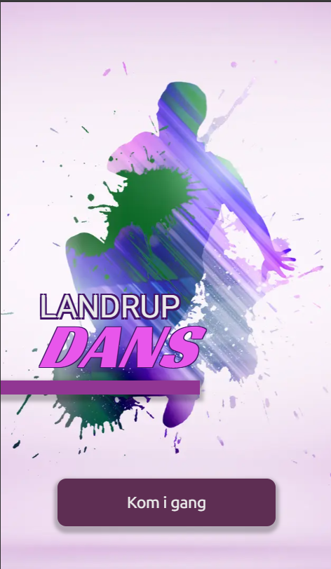

# Dokumentation for Landrup Dans web application
Emma Lindekilde Larsen, WU12

Jeg har lavet valgfri opgave B    





## Kom i gang
`npm install sass react-icons`  
`npm install --save-dev sass`  
`npm run dev`

## Tech-stack
* **React**
React er et open source front-end JavaScript bibliotek, hvor jeg kan bygge user interfaces baseret på komponenter. React har god state-håndtering, og med React kan jeg nøjes med at opdatere de dele af DOM'en, der ændrer sig, når data ændrer sig og dermed undgå genindlæsning af hele DOM'en. Desuden er React et populært bibliotek, der også et stærkt community og er velunderstøttet.

* **Next.js**
Next.js er et open source front-end framework baseret på React. Next giver mulighed for mappebaseret routing samt rendering af komponenter og funktioner på serveren. Next komplimenterer React godt, da React renderer indhold i klienten. Det er en fordel at bruge Next til at server-rendere de komponenter og funktioner, der ikke modtager input fra brugeren, fordi det giver højere sikkerhed når denne funkltionalitet afvikles på serveren fremfor i klienten. Det giver også lavere indlæsningstid for brugeren når en del af indholdet renderes på serveren frem for på deres device.

* **Zod**
Zod er et valideringsbibliotek, der virker med TypeScript og JavaScript. Med Zod kan jeg definere skemaer, jeg kan bruge til at validere forskellige datatyper, eksempelvis strings og mere komplekse strukturer, såsom nestede objekter.

* **React-icons**
React-icons er et bibliotek, der giver mig adgang til de fleste større open source ikonbiblioteker, f.eks. Font Awesome. Med react-icons kan jeg nemt importere forskellige svg ikoner og bruge dem i min app.

* **SASS**
SASS (syntactically awesome style sheets) er et extension language, som tillader mig bl.a. at lave nestede stylingregler. Det er smart fordi jeg skal skrive færre tegn for at style underliggende elementer, når jeg f.eks. bruger BEM-navngivning. BEM er en navngivningskonvention, hvor DOM'en inddeles i blokke, som gives et navn. Blokkene kan inddeles i elementer, som også gives et navn og igen i modifiers, som gives et navn. Konventionen er at skrive block__element--modifier, og denne syntax virker godt sammen med den nesting, jeg kan lave i reglerne, når jeg bruger SASS.

* **Git**
Git er et versionsstyringsværktøj, hvor jeg kan lave branches og versioner af min kode, så jeg kan gå tilbage til tidligere versioner, hvis jeg f.eks. har lavet en ændring, jeg gerne vil fortryde. Jeg bruger Git sammen med GitHub, en hosting platform, der implementerer Git.

* **Landrup Dans API**
Et API er et sæt af regler, som medierer kommunikationen mellem forskellige software applikationer, eksempelvis en klient og en server.
I denne applikation sender jeg http-requests til Landrup Dans API'et, nogle gange sammen med en access token, og API'et sender den relevante data tilbage til mig, så jeg kan vise den på siden eller bruge den til anden relevant funktionalitet, såsom at bestemme, hvilket indhold, der skal vises, baseret på hvilken rolle, brugeren har.

## Kodeeksempel
aktivitetsdetaljer underside  
fil: (specialheaderlayout)/aktivitet/[id]/page.jsx
```jsx
import './_activity-page.scss';
import { getCurrentUser, getSingleActivity } from "@/utilities/getApiData";
import { notFound } from "next/navigation";
import { cookies } from "next/headers";
import styles from '../../../page.module.scss';
import SiteHeaderSpecial from '@/components/ui/headers/site-header-special';
import SiteFooter from '@/components/ui/site-footer';

export async function generateMetadata({ params }) {
    
    const {id} = await params;
    const data = await getSingleActivity(id);

    return {
        title: data?.name
    }
}

export default async function aktivitetsDetaljerPage({ params }) {

    const {id} = await params;
    const activityData = await getSingleActivity(id);
    const cookieStore = await cookies();
    const userId = cookieStore.get('landrupdans_userId');
    const userRole = cookieStore.get('landrupdans_userRole');
    const access_token = cookieStore.get('landrupdans_access_token');
    const PAGE_STATE_NO_USER = 'public';
    const PAGE_STATE_USER = 'default';
    const PAGE_STATE_INSTRUCTOR = 'instructor';
    let pageState = PAGE_STATE_NO_USER;
    let userData = null;

    if (!activityData) {
        notFound();
    }
    
    if (userId && access_token) {
        userData = await getCurrentUser(userId.value, access_token.value);
    }

    if (userRole?.value === 'default') {
        pageState = PAGE_STATE_USER;
    }

    if (userRole?.value === 'instructor') {
        pageState = PAGE_STATE_INSTRUCTOR;
    }

    return (
        <div className={`${styles.common_font} activity-page__wrapper`}>
            {pageState === 'public' && <SiteHeaderSpecial activityData={activityData} pageState={pageState} />}
            {pageState === 'default' && <SiteHeaderSpecial 
                activityData = {activityData}
                userData={userData}
                userId={userId.value}
                access_token={access_token.value}
                pageState={pageState}
            />}
            {pageState === 'instructor' && <SiteHeaderSpecial activityData={activityData} pageState={pageState} />}
            <main className="activity">
                <h1 className="activity__heading">{activityData?.name}</h1>
                <span>{activityData?.minAge}-{activityData?.maxAge} år</span>
                <span className="line-break">{activityData?.weekday} {activityData?.time}</span>
                <p>{activityData?.description}</p>
            </main>
            <SiteFooter />
        </div> 
    )
}
```

Jeg vil gerne fortælle om undersiden, der viser detaljerne for en enkelt aktivitet.

* **Dynamisk url:**  
Jeg har valgt at siden skal have url strukturen domæne/aktivitet/[id], hvor [id] er id'et for den aktivitet, der bliver vist på detaljesiden.
url'en er altså dynamisk, og bliver genereret ud fra hvilket id jeg sender med i linket på domænets forside, som viser hen til detaljesiden. Jeg har kaldt indholdet af sluggen i mappestrukturen for id, fordi det er id'et jeg sender med i url'en, og som jeg skal bruge til at hente data fra api'et om aktviteten.

* **Asynkrone funktioner og params:**  
På detaljesiden har jeg to asynkrone funktioner, generateMetadata() og aktivitetsDetaljerPage().
De er asynkrone fordi de indeholder funktioner eller handlinger, der skal hente noget data fra et andet sted, både fra params-objektet, api'et og fra cookies. Det kan tage tid at hente data på denne måde og derfor skal funktionerne deklar
Jeg destrukturerer props i begge funktioner og henter property'en params ud.
Params-objektet indeholder property'en id, jeg destrukturerer det og gemmer id i en variabel. Denne handling er asynkron og derfor skal funktionerne deklareres med keywordet async, det tillader at vi inde i funktionerne kan bruge keywordet await de steder, hvor vi skal hente data.

* **generateMetadata funktionen:**  
generateMetadata er en indbygget funktion i next.js, som bruges til at generere dynamisk metadata, baseret på dynamisk information. Metadataen bruger jeg her til at vise aktivitetens navn som tekst på browsertabben. Jeg skal bruge aktivitetens id til at fetche data om aktiviteten, herunder dens navn. 
Jeg finder id'et, som jeg har i url'en, ved at destrukturere funktionens props objekt og hente property'en params ud.
Jeg kan finde id'et som en property i params fordi params indeholder url-strukturen og jeg har kaldt den dynamiske del id i min mappestruktur.
Når jeg har hentet id'et ud kan jeg bruge det til at fetche aktivitetens detaljer fra api'et.
Jeg har skrevet min fetch funktion i et andet dokument, som jeg gerne vil fortælle mere om til mundtlig eksamen hvis det kunne være relevant. (nu lader jeg lige som om jeg skal til mundtlig eksamen med denne opgave).
Jeg sætter sidens titel til aktivitetens navn og returnerer dette fra generateMetadata funktionen.

* **aktivitetsDetaljerPage funktionen:**  
i aktivitetsDetaljerPage funktionen finder jeg igen aktivitetens id vha. params og fetcher data fra api'et om aktiviteten.

* **Cookies:**  
Jeg henter også tre cookies vha. den indbyggede next-funktion cookies(). Cookies er en asynkron funktion, som tillader mig at læse cookies i server komponenter (som eks. denne server-renderede page komponent), samt at læse og skrive cookies i server actions og route handlers. Disse cookies oprettes når brugeren logger ind og findes altså kun hvis nogen er logget ind. De tre cookies indeholder hhv. brugerens id, rolle og access token. hvis ingen er logget ind, og siden i stedet vises offentligt, er disse værdier undefined.

* **Variabler:**  
Jeg opretter tre konstanter, jeg kalder page states, som skal holde styr på hvilken tilstand siden er i og på baggrund af dette bestemme, hvilket indhold, der skal vises. De tre tilstande kalder jeg public, default og instructor. Jeg opretter også en variabel, jeg kalder pageState, starter med at antage, at ingen er logget ind, og sætter den til no user/public.
Jeg opretter også en variabel, userData, der kan modtage brugerdata, hvis nogen er logget ind.
pageState og userData er ikke konstanter, da jeg gerne vil kunne overskrive dem med nye værdier senere i koden.

* **Betingede sætninger:**  
Nu har jeg nogle betingede sætninger, som skal hjælpe mig med at bestemme hvilket indhold, der skal vises på siden.
Jeg starter med en guard clause, der tjekker om mit fetch af aktivitetens data er gået godt. Hvis aktivitetens data ikke er blevet hentet, så kalder jeg den indbyggede next-funktion notFound(), som stopper resten af koden og i stedet renderer den not-found.jsx fil, jeg har liggende i min app mappe.
hvis vi kommer videre fra denne guard clause, køres nu en betinget sætning, som gælder hvis brugerens rolle er default og vi har fået id og access token fra cookien. Jeg bruger optional chaining på userRole.value, for hvis ingen er logget ind har userRole ingen value og jeg ville få en fejl. Hvis betingelserne er opfyldt fetcher jeg data om brugeren og gemmer det i userData variablen. Jeg sætter også pageState til user/default.
Til sidst en betinget sætning, der igen med optional chaining tjekker om rollen vi hentede fra cookie er instructor, og hvis den er, sætter pageState til instructor.

* **jsx:**  
Jeg returnerer en div med class wrapper, en header komponent, et main element med dynamisk info om aktiviteten og en footer komponent.
header komponenten har jeg selv skrevet og den skal have forskellige properties med i props objektet afhængig af hvad pageState er. Jeg bruger { } til at skrive noget JavaScript inde mellem mine jsx-elementer, og i den JavaScript genererer jeg en siteheader med et sæt props, hvis pageState er public eller instructor og et andet sæt props hvis pageState er default/user. 
Disse props skal bruges til at generere de rigtige knapper eller formularer med den rette funktionalitet inde i headerkomponentet.
